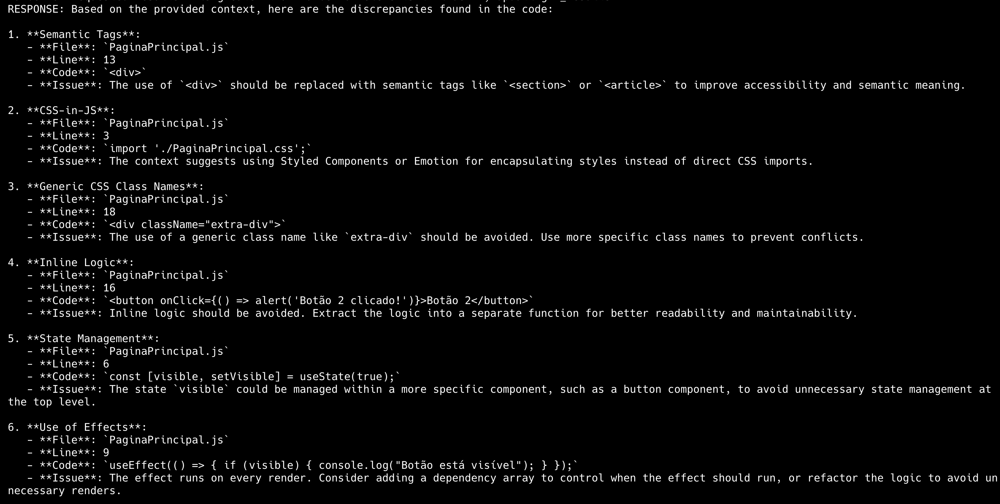

# AI Code reviewer (LLM & RAG) 🤖

This project is a smart code reviewer that uses Large Language Models (LLM) and Retrieval-Augmented Generation (RAG) techniques to help software developers continuously improve code quality.
This tool analyzes code blocks and returns suggestions, identifies inadequate standards, and suggests best development practices.

## Main features ⚡️

- **Auto Code Analyzer:**  
  Uses advanced language models to perform code reviews, identifying inconsistencies, potential bugs, and necessary refactoring.

- **Suggestions Based in Context:**  
  Using RAG, the system is able to retrieve important information (e.g., project standards, documentation, and good practices) and return custom recommendations based on the project context.

- **Customization and Extensibility:**  
  The project was developed with extensibility in mind, allowing users to adjust parameters, improve language models, and expand features when necessary.

## What is RAG? 🤨

Retrieval-Augmented Generation (RAG) integrates retrieval mechanisms with generative models. It first fetches contextually relevant external information, then leverages this data to produce enhanced, accurate, and informed responses—allowing AI to generate context-aware outputs beyond its static training data.


## Running Application (Example) 👀

### Files

-> [Good Coding Practices](llm_reviewer/files/good-code.md)

-> [Pull Request](llm_reviewer/files/pull-request.txt)

### Response



## Stack 🧩

- **Language:** Python, Poetry and LangChain
- **AI Models:** Using LLMs for natural language processing and RAG to retrieve answers based on a knowledge base.

## Project 🏎️

### Install deps

```bash
poetry install
```

### Run project

```bash
poetry run dev
```

### Run with local LLM (Extra)

```bash
docker-compose up
```

> after run project

```bash
poetry run dev
```

## TODO 📋

### Must Have

- [x] Allow the use of more than one model
- [x] Use various types of embeddings
- [ ] Add AI agent (next feature)
- [ ] Enable dynamic uploading of the rules file
- [ ] Split the DIFF file into individual diffs (by checking the token count)

### Nice to Have

- [ ] Function to add the new file to the RAG
- [ ] Visual interface
- [ ] Improve the parameters for each LLM
