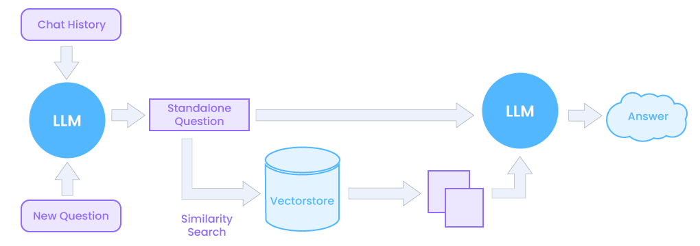
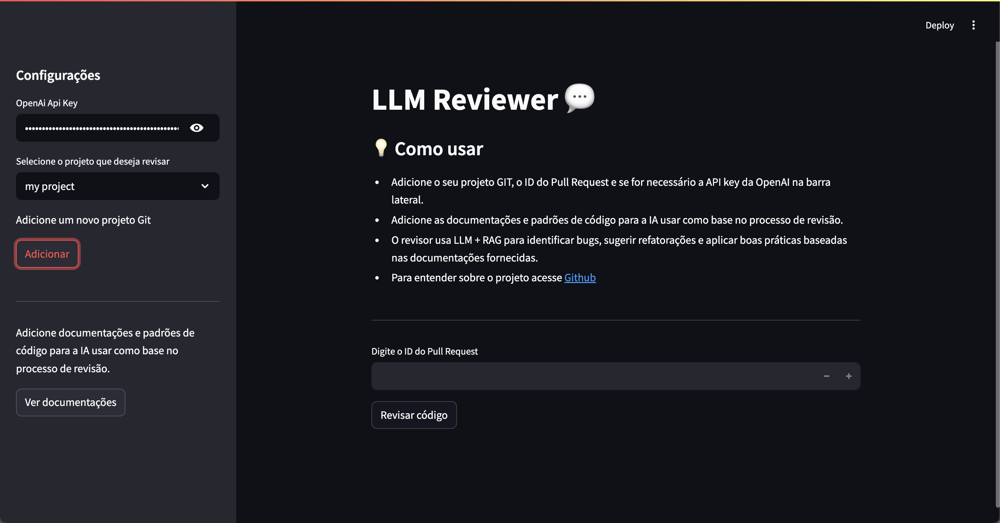

# AI Code reviewer (LLM & RAG) 🤖

This project is a smart code reviewer that uses Large Language Models (LLM) and Retrieval-Augmented Generation (RAG) techniques to help software developers continuously improve code quality.
This tool analyzes code blocks and returns suggestions, identifies inadequate standards, and suggests best development practices.

## Main features ⚡️

- **Auto Code Analyzer:**  
  Uses advanced language models to perform code reviews, identifying inconsistencies, potential bugs, and necessary refactoring.

- **Suggestions Based in Context:**  
  Using RAG, the system is able to retrieve important information (e.g., project standards, documentation, and good practices) and return custom recommendations based on the project context.

- **Customization and Extensibility:**  
  The project was developed with extensibility in mind, allowing users to adjust parameters, improve language models, and expand features when necessary.

<details>
  <summary><strong>What is RAG? 🤨</strong></summary>
  Retrieval-Augmented Generation (RAG) integrates retrieval mechanisms with generative models. It first fetches contextually relevant external information, then leverages this data to produce enhanced, accurate, and informed responses—allowing AI to generate context-aware outputs beyond its static training data.

  
</details>

## Running Application 👀

### Code documentations

### Environment file

After that, you must add the information in `.env`, like:

```
API_URL=http://localhost:11434 // Or another URL
API_KEY= // Your LLM api key (if necessary)
DB_PATH=vectorstore/db // Or another path
COLLECTION_NAME=good-code // Or name for your VectorStore BD
GIT_TOKEN= // Gitlab token
GIT_BASE_URL= // Base url for the GitLab project
GIT_PROJECT_ID= // Project ID
GIT_MERGE_REQUEST_IID= // Merge Request number
CODE_MODEL= // Some llm code model
CONVERSATION_MODEL= // Some llm conversation model
```

> ⚠️ Important: This application now supports GitLab

## Stack 🧩

- **Language:** Python, Poetry and LangChain
- **AI Models:** Using LLMs for natural language processing and RAG to retrieve answers based on a knowledge base.

## Streamlit UI via Docker 🐳 (recommended)

### Prerequisites

- Docker
- `docker-compose` (or Make)

### Quick Start

Build and launch the UI and its Redis dependency:

```bash
# If you have a Makefile
make docker-up

# Or directly with Docker Compose
# docker-compose up --build # legacy
docker compose up --build
```

Then open your browser at:

```
http://localhost:8501
```

### UI Preview



### Features

- **Git Project Manager**
  Add, remove and review multiple Git repositories in one place.
- **API Key Configuration**
  Update your `OPENAI_API_KEY` on-the-fly from the sidebar.
- **Knowledge Base Upload**
  Upload PDF to enrich the LLM’s context for more accurate reviews.
- **Built-in Sample Doc**
  A boilerplate code-documentation PDF is available at
  `llm_reviewer/docs/standard_documentation.pdf`.

💡 **Live Reload**
All local code changes are mirrored into the container (via a volume), so edits appear instantly—no rebuild required.

---

## Terminal way 👨‍💻

You can run via terminal

### Install poetry

To get started, you need [Poetry](https://python-poetry.org/). It's recommended to install it using [pipx](https://pipx.pypa.io/stable/).

Follow this [installation guide](https://pipx.pypa.io/stable/installation/) to set up `pipx`.

Once `pipx` is installed, use the following command to install Poetry:

```bash
pipx install poetry
```

That's it! Poetry is now installed on your machine. 🚀

### Virtual Environment (venv)

> You need `python3` with minimum version `@3.12.4`

Start venv

```bash
poetry env use python3
```

---

If you recived follow error:

```
The currently activated Python version 3.X.X is not supported by the project (3.12.4).
Trying to find and use a compatible version.
```

You need install `pyenv`

<details>
<summary><strong>Install `pyenv`</strong></summary>

Macos

```bash
brew install pyenv
```

Unix System:

```bash
curl https://pyenv.run | bash
```

After install `python@3.12.4`

```bash
pyenv install 3.12.4
```

Use version in project

```bash
pyenv local 3.12.4
poetry env use $(pyenv which python)
```

</details>

### Install deps

```bash
poetry install
```

> if .env not works, you run follow command:

```bash
poetry self add poetry-plugin-dotenv
```

### Run project

```bash
poetry run dev
```

## Run with a Local LLM (Optional)

Leverage Ollama to run your models entirely on-premise.

### Prerequisites

- Install Ollama: [https://ollama.com/](https://ollama.com/)
- Pull or run at least one Ollama model (e.g. `llama2`, `codewizard`).

### 1. Start the Ollama Server

```bash
ollama serve
```

By default, this will listen on `http://localhost:11434`.

### 2. Download or Run a Model

```bash
# Pull a model to your local cache
ollama pull <MODEL_NAME>

# Or directly run (it will auto-pull if missing)
ollama run <MODEL_NAME>
```

### 3. Configure Your Environment

Add your chosen models to the `.env` file:

```env
# ollama default ulr (or other if you changed)
API_URL=http://localhost:11434

# for code review / analysis
CODE_MODEL=<MODEL_NAME>

# for free-form conversation / chat
CONVERSATION_MODEL=<MODEL_NAME>
```

### 4. Instantiate the LLM in Python

```python
from llm_reviewer.llm import LLM, AcceptableLLMModels, AcceptableLLMProviders

llm = LLM(
    model=AcceptableLLMModels.CONVERSATION_MODEL,
    provider=AcceptableLLMProviders.OLLAMA,
)
```

Now, when you run the Streamlit app (`docker compose up` or `make docker-up`), it will connect to your local Ollama instance instead of OpenAI.

## 📋 Roadmap

<details>
<summary><strong>Must-Have</strong></summary>

- [x] Multiple model support
- [x] Custom embeddings
- [x] Dynamic PDF uploads
- [ ] Auto-updating vector store (add, update, delete)
</details>

<details>
<summary><strong>Nice-to-Have</strong></summary>

- [ ] Auto-review agent
- [ ] More platform integrations
</details>
